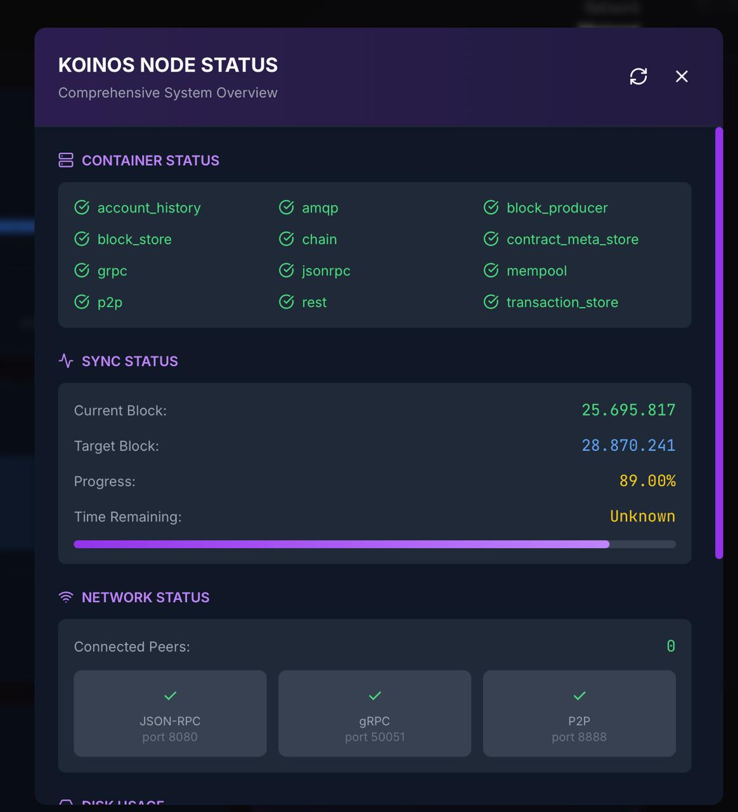
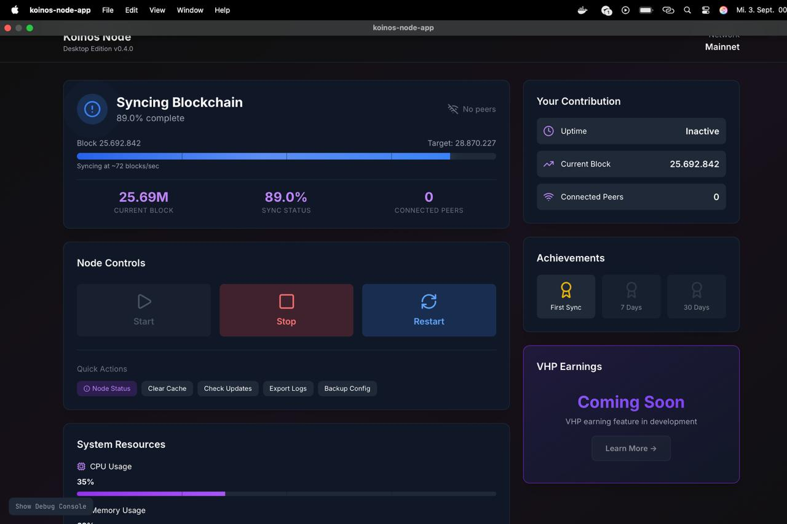
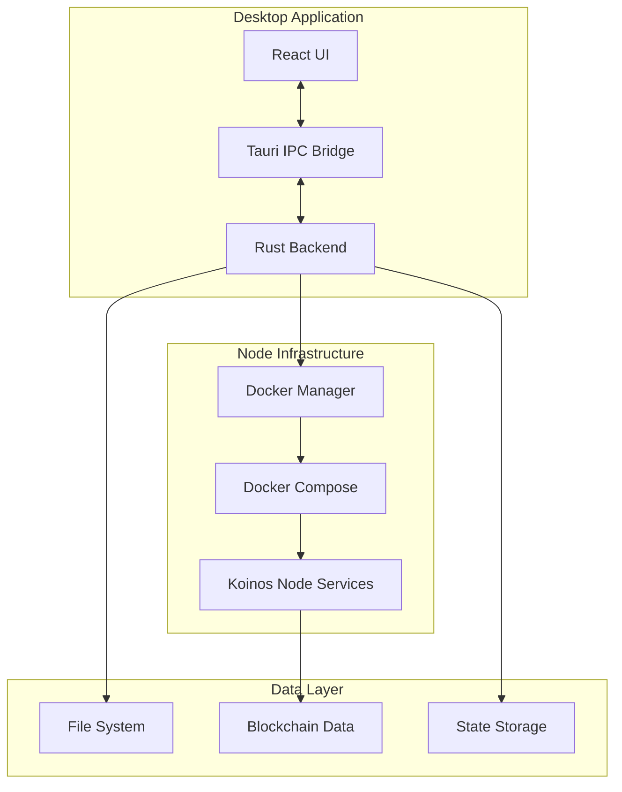

# Koinos Desktop Node

<div align="center">
  
  
  
  
  
  
  
  **Run a full Koinos blockchain node with a single click**
  
  [Features](#features) • [Installation](#installation) • [Architecture](#architecture) • [Development](#development) • [Troubleshooting](#troubleshooting)
  
</div>

## Overview

Koinos Desktop Node is a cross-platform desktop application that makes running a Koinos blockchain node as simple as clicking a button. Built with Tauri (Rust + TypeScript), it provides a beautiful native interface while managing Docker containers, blockchain synchronization, and node operations behind the scenes.

### Screenshots

<div align="center">
  
  <p><em>Koinos Desktop Node v0.4.0 - Main dashboard with node controls and status monitoring</em></p>
  
  
  <p><em>Koinos Desktop Node v0.4.0 - Additional dashboard panels and system resources</em></p>
</div>

## Features

- 🚀 **One-Click Setup** - Automatic installation of dependencies and blockchain snapshot
- 🎨 **Modern UI** - Beautiful, responsive interface with real-time status updates
- 🔧 **Auto-Configuration** - Handles Docker setup, environment variables, and network configuration
- 📊 **Resource Monitoring** - Live CPU, memory, and disk usage tracking
- 🔄 **Smart Synchronization** - Automatic blockchain snapshot download with resume support
- 🛡️ **Secure by Default** - APIs bound to localhost, secure key storage planned
- 🪟 **Cross-Platform** - Native performance on macOS, Linux, and Windows
- 🔍 **Debug Console** - Built-in log viewer for troubleshooting

## Quick Start

### Prerequisites

- **Docker Desktop** (macOS/Windows) or **Docker Engine** (Linux)
- **Rust toolchain** via [rustup](https://rustup.rs/)
- **Node.js 18+** and npm

### Installation

```bash
# Clone the repository
git clone https://github.com/koinos/koinos-desktop-node.git
cd koinos-desktop-node/koinos-node-app

# Install dependencies
npm install

# Development mode (web)
npm run dev

# Development mode (desktop)
npm run tauri dev

# Build production app
npm run tauri build
```

### First Run Experience

1. **System Check** - Verifies Docker installation (guides to install if missing)
2. **Node Setup** - Clones Koinos repository and configures environment
3. **Blockchain Sync** - Downloads ~30GB snapshot or syncs from genesis
4. **Launch** - Starts all 12 Koinos microservices via Docker Compose

## Architecture

### System Overview



### Component Architecture

#### Frontend Stack (TypeScript + React)

```
src/
├── components/
│   ├── Dashboard.tsx         # Main application interface
│   ├── StatusIndicator.tsx   # Node status display with sync progress
│   ├── NodeControls.tsx      # Start/Stop/Restart controls
│   ├── WelcomeScreen.tsx     # First-run onboarding
│   ├── InitializationProgress.tsx  # Setup progress tracking
│   ├── DebugConsole.tsx      # Real-time log viewer
│   ├── StatusModal.tsx       # Detailed node information
│   └── ProgressBar.tsx       # Reusable progress component
├── App.tsx                   # Application root with state management
├── main.tsx                  # React entry point
└── styles/                   # Tailwind CSS configuration
```

**Key Frontend Technologies:**
- **React 18** with TypeScript for type safety
- **Framer Motion** for smooth animations
- **Tailwind CSS** for utility-first styling
- **Tauri API** for native system integration
- **Lucide React** for consistent iconography

#### Backend Architecture (Rust)

```
src-tauri/src/
├── lib.rs              # Tauri command registration & event system
├── node_manager.rs     # Core node operations & Docker orchestration
├── auto_installer.rs   # Cross-platform dependency installation
├── state_manager.rs    # Persistent application state
├── logger.rs          # Centralized logging with event streaming
└── docker_utils.rs    # Docker API interactions
```

**Core Backend Components:**

1. **NodeManager** (`node_manager.rs`)
   - Docker container lifecycle management
   - Blockchain synchronization monitoring
   - Resource usage tracking
   - JSON-RPC communication with node
   - Snapshot download/extraction with resume

2. **AutoInstaller** (`auto_installer.rs`)
   - Platform-specific Docker installation
   - Homebrew integration (macOS)
   - APT/YUM package management (Linux)
   - Windows installer automation

3. **StateManager** (`state_manager.rs`)
   - Persistent storage using `dirs` crate
   - Application state serialization
   - Uptime tracking
   - Configuration management

4. **Logger** (`logger.rs`)
   - Thread-safe log buffering
   - Real-time event emission to frontend
   - Log level filtering
   - Circular buffer for memory efficiency

### Docker Container Architecture

The application manages 12 interconnected Koinos microservices:

```yaml
Services:
  koinos:           # Main blockchain node
  block_store:      # Block data persistence
  chain:           # Blockchain state management
  mempool:         # Transaction pool
  p2p:             # Peer-to-peer networking
  block_producer:  # Block creation (if enabled)
  contract_meta:   # Smart contract metadata
  account_history: # Account transaction history
  transaction_store: # Transaction persistence
  jsonrpc:         # JSON-RPC API endpoint
  grpc:           # gRPC API endpoint
  rabbitmq:       # Inter-service message bus
```

**Service Communication:**
```
[JSON-RPC Client] --> [jsonrpc:8080] --> [RabbitMQ:5672] --> [Microservices]
                                               ^
                                               |
                                         [AMQP Protocol]
```

### Data Flow Architecture

#### Status Update Flow
```
Node (Docker) -> JSON-RPC -> Rust Backend -> IPC Events -> React UI
     ^                           |
     |                           v
     +------- Docker API --------+
```

#### Initialization Sequence
```
1. Check Requirements -> 2. Install Docker -> 3. Clone Repo -> 4. Configure Environment
                                                    |
                                                    v
8. Start Services <- 7. Extract Snapshot <- 6. Verify Data <- 5. Download Snapshot
```

### File System Layout

```
~/                              # User home directory
├── koinos/                     # Cloned Koinos repository
│   ├── .env                    # Docker Compose configuration
│   ├── docker-compose.yml      # Service definitions
│   └── config/                 # Node configuration files
├── .koinos/                    # Blockchain data directory
│   ├── block_store/           # Block database
│   ├── chain/                 # Chain state
│   ├── contract_meta/         # Contract metadata
│   └── transaction_store/     # Transaction history
└── .config/koinos-node/       # Application state
    └── state.json             # Persistent app data
```

### IPC Communication

The frontend and backend communicate through Tauri's secure IPC bridge:

#### Commands (Frontend -> Backend)
```typescript
// Frontend invocation
await invoke('start_node')
await invoke('get_node_status')
await invoke('download_snapshot')

// Backend handler
#[tauri::command]
async fn start_node(manager: State<'_, Arc<Mutex<NodeManager>>>) -> Result<(), String>
```

#### Events (Backend -> Frontend)
```typescript
// Backend emission
window.emit("node_status_update", status)

// Frontend listener
listen<NodeStatus>('node_status_update', (event) => {
  updateUI(event.payload)
})
```

### Security Architecture

1. **Network Security**
   - All APIs bound to `127.0.0.1` by default
   - No external port exposure without explicit configuration
   - Secure WebSocket connections for real-time updates

2. **Process Isolation**
   - Tauri's secure context isolation
   - Minimal permissions requested
   - Sandboxed file system access

3. **Future Security Enhancements**
   - OS keychain integration for sensitive data
   - Encrypted configuration storage
   - Audit logging for critical operations

## Development

### Project Setup

```bash
# Install Rust toolchain
curl --proto '=https' --tlsv1.2 -sSf https://sh.rustup.rs | sh

# Install Tauri CLI
cargo install tauri-cli

# Install frontend dependencies
npm install

# Run in development mode
npm run tauri dev
```

### Build Commands

```bash
# Development builds
npm run dev          # Web development server
npm run tauri dev    # Desktop development mode

# Production builds
npm run build        # Build web assets
npm run tauri build  # Build desktop application

# Platform-specific builds
npm run tauri build -- --target universal-apple-darwin  # macOS Universal
npm run tauri build -- --target x86_64-pc-windows-msvc  # Windows x64
npm run tauri build -- --target x86_64-unknown-linux-gnu # Linux x64
```

### Code Style Guidelines

**TypeScript/React:**
- 2-space indentation
- Functional components with hooks
- PascalCase for components
- Comprehensive TypeScript types
- Props interfaces for all components

**Rust:**
- Rust 2021 edition
- `cargo fmt` for formatting
- `cargo clippy` for linting
- Comprehensive error handling with `Result<T, E>`
- Async/await for I/O operations

### Testing

```bash
# Frontend tests
npm run test

# Rust tests
cd src-tauri && cargo test

# End-to-end tests
npm run test:e2e
```

## API Reference

### Tauri Commands

| Command | Description | Parameters | Returns |
|---------|------------|------------|---------|
| `check_system_requirements` | Verify Docker installation | None | `SystemRequirements` |
| `auto_install_requirements` | Install Docker automatically | None | `Result<String>` |
| `setup_node` | Initialize node configuration | None | `Result<()>` |
| `start_node` | Start all node services | None | `Result<()>` |
| `stop_node` | Stop all node services | None | `Result<()>` |
| `restart_node` | Restart all services | None | `Result<()>` |
| `get_node_status` | Get current node status | None | `NodeStatus` |
| `get_detailed_status` | Get comprehensive status | None | `DetailedStatus` |
| `get_resource_usage` | Get system resource metrics | None | `ResourceUsage` |
| `download_snapshot` | Download blockchain snapshot | None | `Result<()>` |
| `is_initialized` | Check if node is set up | None | `bool` |

### Event Types

```typescript
interface NodeStatus {
  status: 'stopped' | 'starting' | 'running' | 'stopping' | 'error'
  sync_progress: number
  current_block: number
  target_block: number
  peers_count: number
  error_message?: string
}

interface ResourceUsage {
  cpu_percent: number
  memory_mb: number
  memory_total_mb: number
  disk_used_gb: number
  disk_total_gb: number
}
```

## Troubleshooting

### Common Issues

#### Docker Desktop Not Found
**Problem:** "Docker Desktop is starting" or "Docker not found"

**Solution:**
1. Ensure Docker Desktop is installed and running
2. On macOS: Enable "Install CLI tools" in Docker Desktop settings
3. Verify installation: `which docker` should return `/usr/local/bin/docker`
4. Restart the application after Docker is ready

#### AMQP Connection Errors
**Problem:** `AMQP error dialing server: connection refused`

**Solution:** This is normal during startup. Services take 10-30 seconds to initialize. The error will resolve once RabbitMQ is ready.

#### Sync Status Discrepancy
**Problem:** Different block heights shown in UI components

**Solution:** Fixed in v0.4.0. Update to the latest version.

#### Linux Permission Denied
**Problem:** Docker commands fail with permission errors

**Solution:**
```bash
# Add user to docker group
sudo usermod -aG docker $USER
# Log out and back in for changes to take effect
```

#### Snapshot Download Issues
**Problem:** Download fails or doesn't resume

**Solution:**
1. Ensure 60GB+ free disk space
2. Check internet connection stability
3. The app automatically resumes interrupted downloads
4. Manual download: [Latest Snapshot](https://koinos-snapshots.s3.amazonaws.com/latest.tar.gz)

### Debug Console

Access the built-in debug console for detailed logs:
1. Click "Show Debug Console" button (bottom-left)
2. Filter logs by level or search terms
3. Export logs for support requests

### Log Locations

- **Application logs:** `~/.config/koinos-node/logs/`
- **Docker logs:** `docker logs koinos-node-koinos-1`
- **Node data:** `~/.koinos/`

## Contributing

We welcome contributions! Please see our [Contributing Guidelines](CONTRIBUTING.md) for details.

### Development Workflow

1. Fork the repository
2. Create a feature branch (`git checkout -b feature/amazing-feature`)
3. Commit your changes (`git commit -m 'Add amazing feature'`)
4. Push to the branch (`git push origin feature/amazing-feature`)
5. Open a Pull Request

## License

MIT License - see [LICENSE](LICENSE) file for details

## Acknowledgments

- [Koinos Blockchain](https://koinos.io) - The fee-less blockchain
- [Tauri](https://tauri.app) - Build smaller, faster, and more secure desktop applications
- [React](https://reactjs.org) - A JavaScript library for building user interfaces
- [Docker](https://docker.com) - Container platform for distributed applications

## Support

- **Documentation:** [docs.koinos.io](https://docs.koinos.io)
- **Discord:** [Koinos Community](https://discord.koinos.io)
- **Issues:** [GitHub Issues](https://github.com/koinos/koinos-desktop-node/issues)

---

<div align="center">
  Made with ❤️ by the Koinos Community
</div>